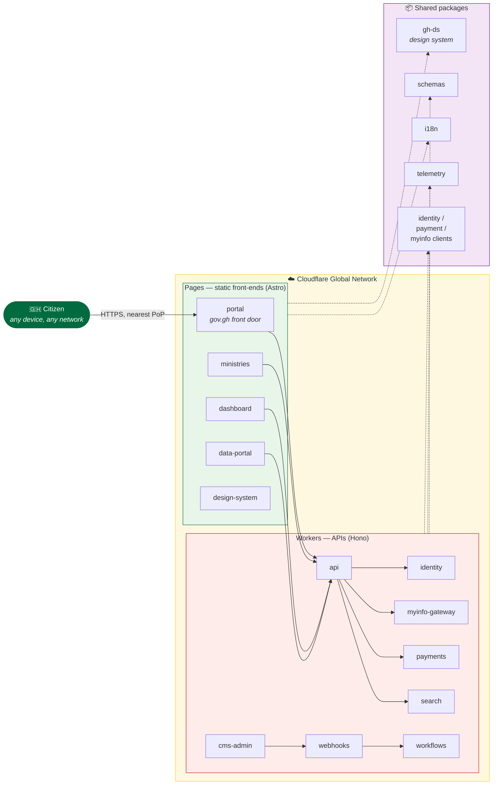

<div align="center">

# 🇬🇭 gov.gh

### The Flagship National Government Portal of the Republic of Ghana

**Every service. Every ministry. Every announcement — in one place.**

[](https://ghana-gov.pages.dev/)
[](https://github.com/ghwmelite-dotcom/ghana/actions/workflows/ci.yml)
[](LICENCE)

[](#non-negotiables-read-first)
[](https://workers.cloudflare.com/)
[](https://astro.build/)
[](https://hono.dev/)
[](https://pnpm.io/)

</div>

---

> **Status.** Week 0–2 foundation. No features shipped. See
> `docs/doctrine/week-0.md` for current repo state and the next three PRs.
> Non-negotiables are in `.claude/CLAUDE.md §1`.

## 🌍 Live

| Environment | URL |
| ----------- | --- |
| **Production portal** | **https://ghana-gov.pages.dev/** |
| Repository | https://github.com/ghwmelite-dotcom/ghana |
| CI | https://github.com/ghwmelite-dotcom/ghana/actions |

## 🏛️ Architecture at a glance

Everything runs on the Cloudflare edge — no origin servers, no cold starts,
no single point of failure.



## 🚀 Quick start

Requires **Node 22+** and **pnpm 9+**.

```bash
pnpm install
pnpm typecheck   # across all workspaces
pnpm lint
pnpm test
pnpm build
```

## 🗺️ Layout

See `.claude/CLAUDE.md §3` for the canonical monorepo map.

| Directory | Ships to | Contents |
| --------- | -------- | -------- |
| `apps/` | **Cloudflare Pages** | `portal` · `ministries` · `dashboard` · `data-portal` · `design-system` — Astro front-ends |
| `services/` | **Cloudflare Workers** | `api` · `identity` · `myinfo-gateway` · `payments` · `cms-admin` · `search` · `webhooks` · `workflows` — Hono APIs |
| `packages/` | shared libraries | `gh-ds` (design system) · `schemas` · `i18n` · `identity-client` · `payment-client` · `myinfo-client` · `telemetry` |
| `infra/` | IaC | OpenTofu, Wrangler fragments, workerd-Docker DR target |
| `content/` | Keystatic | Root content, authored |
| `docs/` | — | ADRs, doctrine, research artefacts, runbooks |
| `.archive/legacy-v0/` | — | Pre-monorepo static prototype, preserved for content migration reference |

## ⛔ Non-negotiables (read first)

1. **Citizens come first.** Grandmother-in-Bolgatanga-on-a-Tecno-Spark test,
   every feature.
2. **Accessibility.** WCAG 2.2 AA minimum. Zero axe-core violations on merge.
3. **Performance.** ≤300 KB total page weight. ≤70 KB initial JS gzipped. LCP
   ≤2.5s on 4G.
4. **Progressive enhancement.** Every form works without JavaScript.
5. **Plain language.** Grade-8, active voice, second person. No acronyms on
   first mention.
6. **Cultural respect.** Adinkra sparingly. Never Gye Nyame as brandmark.
   Folklore Board clearance before ship.
7. **Security-first.** CII-registered. DPA 2012 compliant. Application-layer PII
   encryption.
8. **Open by default.** MIT code, OFL fonts, CC-BY content.
9. **Evidence-driven.** Every design decision cites research, analytics, or peer
   precedent.

Full text in `.claude/CLAUDE.md §1`. Non-negotiables override any conflicting
instruction.

## 🤝 Contributing

- Never push to `main`. PR-only.
- Every PR satisfies `.claude/CLAUDE.md §7` Definition of Done.
- Conventional Commits scoped by package/app (`feat(gh-ds):`, `fix(portal):`).
- ADR required for architectural decisions — see `docs/adr/README.md`.

## 📄 Licence

MIT. See `LICENCE`. Content under CC-BY 4.0 except where noted. Fonts are SIL
OFL, attribution in `packages/gh-ds/fonts/OFL.txt`.

---

<div align="center">
<sub>Built with ❤️ for every Ghanaian — from Accra to Bolgatanga, on any device, on any network.</sub>
</div>
